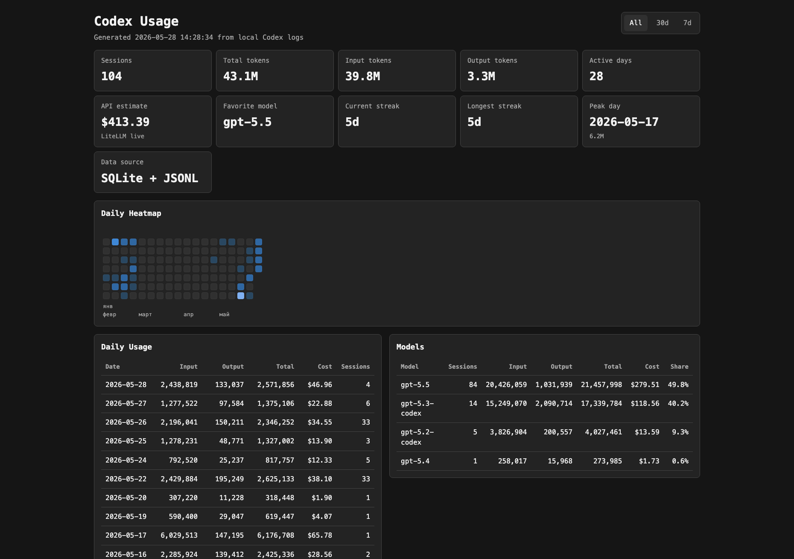

# Codex Usage Dashboard

Local web dashboard for Codex usage statistics. It reads your local Codex state and rollout logs, then renders sessions, token usage, model breakdowns, and a daily heatmap.

This project is not affiliated with OpenAI.



## Features

- Local-only dashboard served on `127.0.0.1`
- Summary cards for sessions, token usage, API-equivalent cost estimate, active days, streaks, peak day, and favorite model
- Daily usage table with input, output, total tokens, and estimated cost
- Model breakdown table with estimated cost by model
- Daily heatmap with month labels and hover tooltips
- Range filters: all time, 30 days, 7 days
- macOS `.command` launcher

## Data Sources

The dashboard reads:

```text
~/.codex/state_5.sqlite
~/.codex/sessions/**/rollout-*.jsonl
```

It uses `state_5.sqlite` to discover Codex threads and rollout paths. Token counts are computed from `token_count` events in rollout JSONL files.

Displayed token accounting follows the same practical convention used by local usage tools:

```text
Input = input_tokens - cached_input_tokens
Output = output_tokens
Total = Input + Output
```

## Cost Estimates

The dashboard estimates API-equivalent USD cost from token counts. It uses the current LiteLLM pricing database when the dashboard loads:

```text
https://raw.githubusercontent.com/BerriAI/litellm/main/model_prices_and_context_window.json
```

If the pricing file cannot be fetched, the dashboard falls back to bundled prices for known Codex models.

Cost accounting follows the same practical formula used by local usage tools:

```text
Cost = Input * input price + Cached input * cache-read price + Output * output price
```

These values are estimates only. They are not your actual OpenAI subscription bill.

Because prices are fetched at dashboard load time, historical days are recalculated with the current price table. If a model's API price changes later, the estimated cost for older dates can change too.

## Privacy

The app runs locally and binds only to `127.0.0.1`.

The frontend receives aggregate usage data only. It does not expose thread titles, prompts, working directories, file paths, or message contents through the normal dashboard API.

Do not run this bound to a public interface unless you have reviewed the code and understand what your local logs contain.

## Requirements

- macOS, Linux, or Windows
- Node.js 20+
- Python 3.10+
- Local Codex logs in `~/.codex`

## Install

```bash
git clone https://github.com/Greenleaf77/Greenleaf-codex-dashboard.git
cd Greenleaf-codex-dashboard
npm install
```

## Update

If you already downloaded an older release, update from the project directory:

```bash
git pull
npm install
```

Then start the dashboard again:

```bash
npm start
```

To install a specific release instead of the latest `main`, use a tag:

```bash
git fetch --tags
git checkout v1.0.1
npm install
```

## Run

```bash
npm start
```

Then open:

```text
http://127.0.0.1:8765/
```

The runner starts:

- Vite frontend on `127.0.0.1:8765`
- Python API on `127.0.0.1:8766`

Stopping the runner with `Ctrl+C` stops both processes.

## macOS Launcher

On macOS you can double-click:

```text
Start Codex Usage Dashboard.command
```

The launcher installs npm dependencies on first run, starts the dashboard, and opens your default browser.

## Scripts

```bash
npm start      # Start Vite + Python API
npm run dev    # Start only Vite
npm run check  # Smoke-check Codex data loading
npm run build  # Build frontend assets
```

## Troubleshooting

### Port already in use

The dashboard uses ports `8765` and `8766`.

If startup fails with `EADDRINUSE`, another dashboard instance is probably still running. Close the previous terminal window or stop the process using the port.

On macOS:

```bash
lsof -nP -iTCP:8765 -sTCP:LISTEN
lsof -nP -iTCP:8766 -sTCP:LISTEN
```

### No data appears

Check that Codex has local logs:

```bash
ls ~/.codex/state_5.sqlite
ls ~/.codex/sessions
```

Then run:

```bash
npm run check
```

## Publishing Your Own Fork

From this directory:

```bash
git init
git add .
git commit -m "Initial open-source release"
gh repo create codex-usage-dashboard --public --source . --remote origin --push
```

Replace the repo name if you want a different GitHub URL.

## License

MIT
